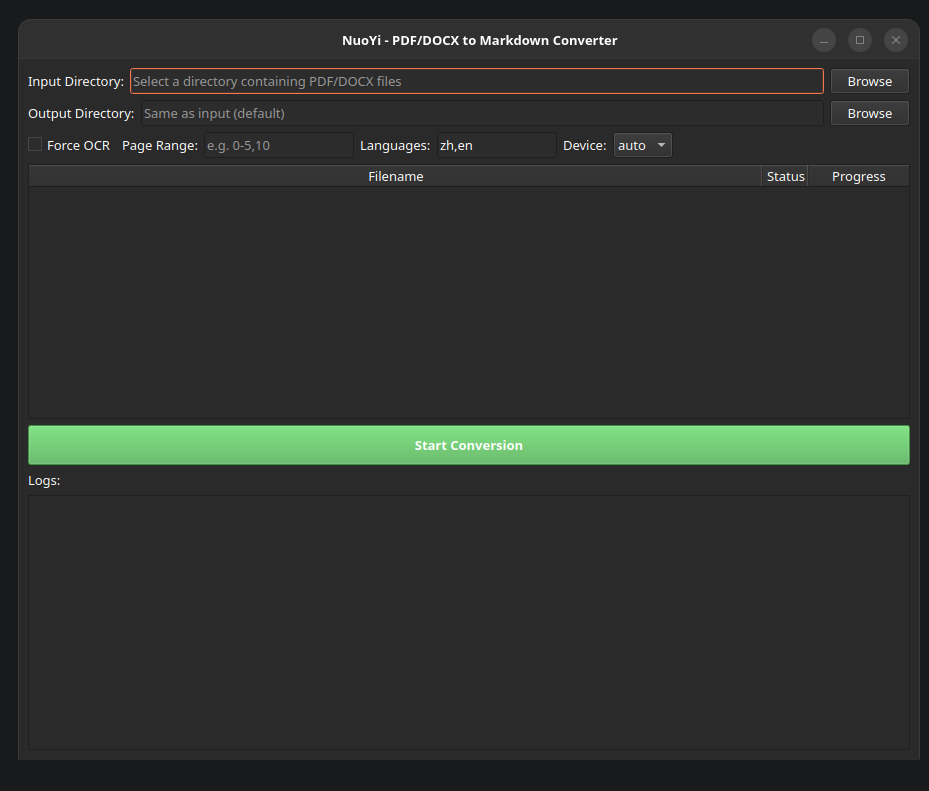
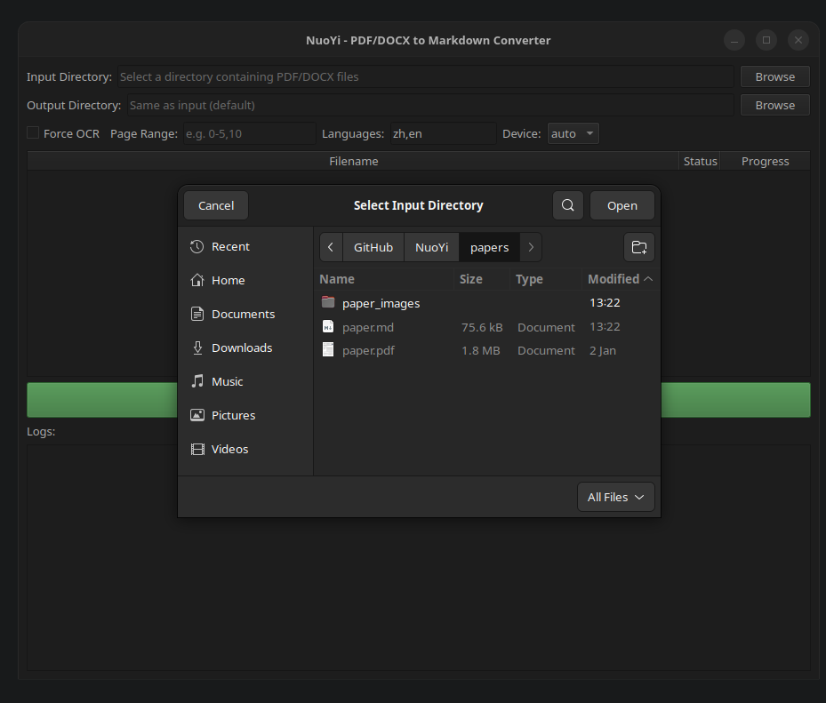
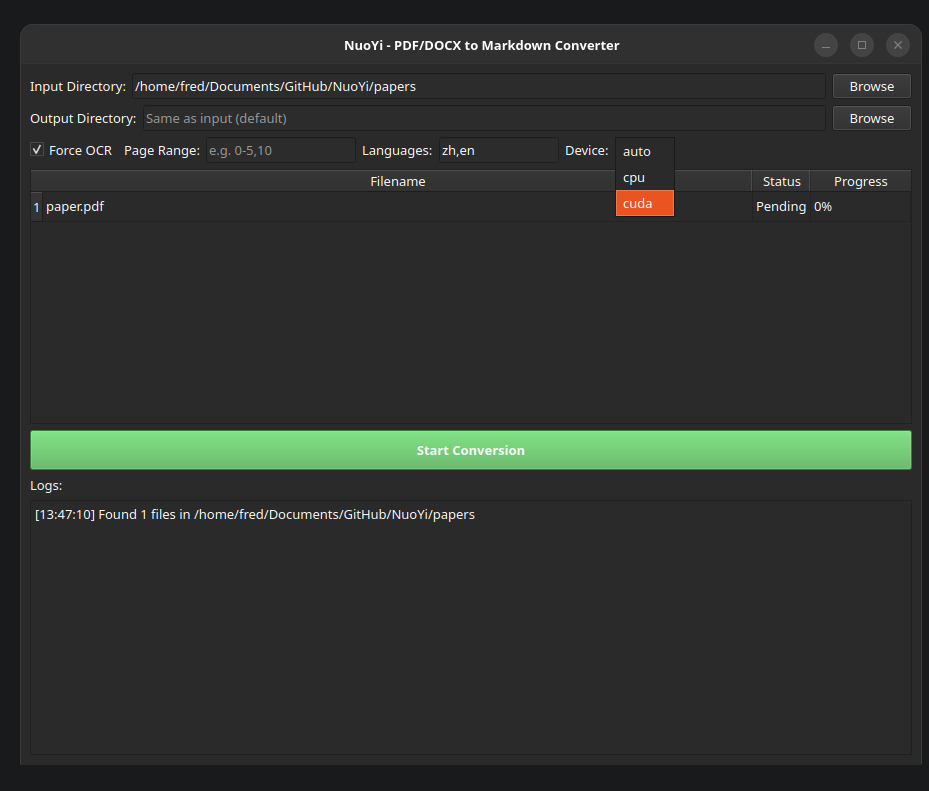
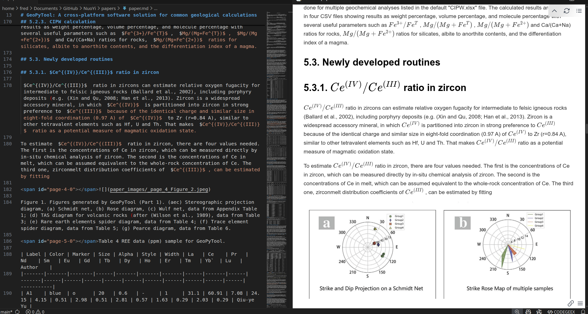

# NuoYi 挪移

一个简单的工具，将 PDF 和 DOCX 文档转换为 Markdown 格式。

[English](README.md)

NuoYi（挪移）使用 [marker-pdf](https://github.com/VikParuchuri/marker) 实现高质量的 PDF 转换，支持 OCR 和版面检测。初次下载模型后，所有处理均可**完全离线**进行。

## 功能特点

- **PDF 转 Markdown**：使用 marker-pdf 配合 surya OCR 实现高质量转换
- **DOCX 转 Markdown**：原生支持 Microsoft Word 文档
- **自动选择 GPU/CPU**：自动检测可用显存，显存不足时自动切换到 CPU
- **批量处理**：支持整个目录的文档批量转换
- **图形界面**：基于 PySide6 的图形界面，方便批量转换操作
- **图片提取**：自动从 PDF 中提取并保存图片
- **多语言支持**：内置中英文支持（可配置其他语言）

## 安装

### 从 PyPI 安装

```bash
pip install nuoyi
```

### 安装图形界面支持

```bash
pip install nuoyi[gui]
```

### 从源码安装

```bash
git clone https://github.com/cycleuser/NuoYi.git
cd NuoYi
pip install -e .
```

## 使用方法

### 命令行界面

```bash
# 转换单个 PDF 文件
nuoyi paper.pdf

# 指定输出文件
nuoyi paper.pdf -o output/result.md

# 转换 DOCX 文件
nuoyi document.docx -o document.md

# 批量转换目录中的所有文件
nuoyi ./papers --batch

# 批量转换并指定输出目录
nuoyi ./papers --batch -o ./output

# 强制使用 CPU 模式（适用于显存不足的情况）
nuoyi paper.pdf --device cpu

# 强制 OCR（即使是数字版 PDF）
nuoyi paper.pdf --force-ocr

# 指定页面范围
nuoyi paper.pdf --page-range "0-5,10,15-20"

# 指定语言
nuoyi paper.pdf --langs "zh,en,ja"
```

### 图形界面模式

```bash
nuoyi --gui
```

图形界面提供：
- 输入/输出目录选择
- 文件列表及状态跟踪
- 设备选择（自动/CPU/CUDA）
- 强制 OCR 选项
- 页面范围和语言配置
- 实时进度和日志显示

**启动界面：**



**选择输入目录：**



**配置设备和选项：**



**转换结果（在 VS Code 中查看）：**



### Python API

```python
from nuoyi import MarkerPDFConverter, DocxConverter

# 转换 PDF
pdf_converter = MarkerPDFConverter(
    force_ocr=False,
    langs="zh,en",
    device="auto"  # 或 "cpu", "cuda", "mps"
)
markdown_text, images = pdf_converter.convert_file("input.pdf")

# 转换 DOCX
docx_converter = DocxConverter()
markdown_text = docx_converter.convert_file("input.docx")
```

## 命令行参数

| 参数 | 说明 |
|------|------|
| `input` | 输入的 PDF/DOCX 文件或目录（配合 --batch 使用） |
| `-o, --output` | 输出文件路径（单文件）或目录（批量模式） |
| `--force-ocr` | 强制 OCR，即使是带有嵌入文本的数字版 PDF |
| `--page-range` | 要转换的页面范围，如 '0-5,10,15-20' |
| `--langs` | 逗号分隔的语言列表（默认：zh,en） |
| `--batch` | 处理输入目录中的所有 PDF/DOCX 文件 |
| `--device` | 模型推理设备：auto（默认）、cpu、cuda 或 mps |
| `--gui` | 启动 PySide6 图形界面 |
| `-V, --version` | 显示版本号并退出 |

## 内存管理

NuoYi 自动管理 GPU 内存：

- **自动模式**（默认）：检测可用显存，显存充足（>6GB）时使用 GPU
- **CPU 模式**：强制使用 CPU 处理（较慢但无显存限制）
- **CUDA 模式**：强制使用 GPU 处理（大型 PDF 可能会显存不足）
- **MPS 模式**：适用于 Apple Silicon Mac

如果转换过程中发生 CUDA 显存不足，NuoYi 会自动切换到 CPU 继续处理。

## 依赖项

### 必需
- `marker-pdf>=1.0.0` - PDF 转换引擎
- `PyMuPDF>=1.23.0` - PDF 页面计数
- `python-docx>=0.8.11` - DOCX 转换
- `Pillow>=9.0.0` - 图像处理

### 可选
- `PySide6>=6.5.0` - 图形界面支持（使用 `pip install nuoyi[gui]` 安装）

## 模型下载

### 下载位置

首次运行时模型会自动下载，存储位置为：

```
~/.cache/huggingface/hub/
```

模型来源于 [Hugging Face](https://huggingface.co/)，包括：
- `vikp/surya_det` - 版面检测模型
- `vikp/surya_rec` - 文字识别模型
- `vikp/surya_order` - 阅读顺序模型
- 其他 marker-pdf 相关模型

总大小约 **2-3 GB**。

### 中国大陆用户

由于 GFW 的原因，中国大陆访问 Hugging Face 可能会被阻断或速度很慢。可以使用镜像站：

```bash
# 设置 Hugging Face 镜像（添加到 ~/.bashrc 或在运行 nuoyi 前执行）
export HF_ENDPOINT=https://hf-mirror.com

# 然后正常运行 nuoyi
nuoyi paper.pdf
```

也可以手动下载模型后放置到缓存目录中。

### 自定义模型路径

当前版本暂不支持自定义模型路径，以保持工具简洁、避免配置复杂化。模型始终存储在默认的 Hugging Face 缓存位置。

## 注意事项

- 模型下载完成后，所有功能均可离线使用
- 如遇到 CUDA 显存不足错误，请使用 `--device cpu`
- 不支持旧版 `.doc` 格式，请先转换为 `.docx`

## 开源协议

GPL-3.0 协议 - 详见 [LICENSE](LICENSE) 文件。

## 贡献

欢迎贡献代码！请随时提交 Pull Request。

## 致谢

- [marker-pdf](https://github.com/VikParuchuri/marker) - 优秀的 PDF 转换引擎
- [surya](https://github.com/VikParuchuri/surya) - OCR 和版面检测模型
