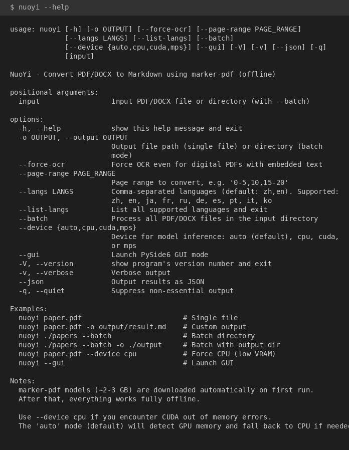

# NuoYi 挪移

一个简单的工具，将 PDF 和 DOCX 文档转换为 Markdown 格式。

[English](README.md)

NuoYi（挪移）使用 [marker-pdf](https://github.com/VikParuchuri/marker) 实现高质量的 PDF 转换，支持 OCR 和版面检测。初次下载模型后，所有处理均可**完全离线**进行。

## 功能特点

- **PDF 转 Markdown**：使用 marker-pdf 配合 surya OCR 实现高质量转换
- **DOCX 转 Markdown**：原生支持 Microsoft Word 文档
- **自动选择 GPU/CPU**：自动检测可用显存，显存不足时自动切换到 CPU
- **批量处理**：支持整个目录的文档批量转换
- **图形界面**：基于 PySide6 的图形界面，方便批量转换操作
- **图片提取**：自动从 PDF 中提取并保存图片
- **多语言支持**：支持中、英、日、法、俄、德、西、葡、意、韩 10 种语言

## 安装

**需要 Python 3.10 或更高版本**（marker-pdf 要求 Python >= 3.10）。

### 从 PyPI 安装

```bash
pip install nuoyi
```

### 安装图形界面支持

```bash
pip install nuoyi[gui]
```

### 安装 NVIDIA CUDA 支持（GPU 用户重要）

如果在使用 GPU 时遇到 `CUBLAS_STATUS_NOT_INITIALIZED` 错误，请安装 CUDA 库：

```bash
pip install nuoyi[cuda]
```

或手动安装：

```bash
pip install nvidia-cublas nvidia-cuda-runtime nvidia-cufft nvidia-cusolver nvidia-cusparse nvidia-curand nvidia-cuda-nvrtc nvidia-nvtx
```

**为什么需要这些？** PyTorch 的 CUDA 包有时不包含所有必需的 NVIDIA 库。`nvidia-*` 包确保 marker-pdf 能正确使用 GPU 加速。

### 完整安装（包含所有功能）

```bash
pip install nuoyi[all-cuda]
```

### 从源码安装

```bash
git clone https://github.com/cycleuser/NuoYi.git
cd NuoYi
pip install -e .
```

### macOS 安装说明

marker-pdf 完全支持 macOS（Intel 和 Apple Silicon 均可）。macOS 上 PyTorch 会自动安装为无 CUDA 版本。Apple Silicon Mac 可以通过 `--device mps` 使用 MPS 加速。

如果在 macOS 上遇到 torch 安装问题，请先安装 CPU 版本的 PyTorch：

```bash
pip install torch torchvision --index-url https://download.pytorch.org/whl/cpu
pip install nuoyi
```

## 使用方法

### 命令行界面

```bash
# 转换单个 PDF 文件
nuoyi paper.pdf

# 指定输出文件
nuoyi paper.pdf -o output/result.md

# 转换 DOCX 文件
nuoyi document.docx -o document.md

# 批量转换目录中的所有文件
nuoyi ./papers --batch

# 批量转换并指定输出目录
nuoyi ./papers --batch -o ./output

# 强制使用 CPU 模式（适用于显存不足的情况）
nuoyi paper.pdf --device cpu

# 强制 OCR（即使是数字版 PDF）
nuoyi paper.pdf --force-ocr

# 指定页面范围
nuoyi paper.pdf --page-range "0-5,10,15-20"

# 指定语言
nuoyi paper.pdf --langs "zh,en,ja"

# 禁用 OCR 模型（数字版 PDF，节省约 1.5GB 显存）
nuoyi paper.pdf --disable-ocr-models

# 低显存模式（4-6GB 显存）
nuoyi paper.pdf --low-vram
```

### 图形界面模式

```bash
nuoyi --gui
```

图形界面提供：
- 输入/输出目录选择
- 文件列表及状态跟踪
- 设备选择（自动/CPU/CUDA）
- 强制 OCR 选项
- 页面范围和语言配置
- 实时进度和日志显示

**启动界面：**


**选择输入目录：**


**配置设备和选项：**


**转换结果（在 VS Code 中查看）：**


### Python API

```python
from nuoyi import MarkerPDFConverter, DocxConverter

# 转换 PDF（完整模型，约 3GB 显存）
pdf_converter = MarkerPDFConverter(
    force_ocr=False,
    langs="zh,en",
    device="auto"  # 或 "cpu", "cuda", "mps"
)
markdown_text, images = pdf_converter.convert_file("input.pdf")

# 转换 PDF（精简模型，数字版 PDF，约 1.5GB 显存）
pdf_converter_minimal = MarkerPDFConverter(
    disable_ocr_models=True,  # 节省约 1.5GB 显存
    langs="zh,en",
    device="auto"
)
markdown_text, images = pdf_converter_minimal.convert_file("digital.pdf")

# 转换 PDF（低显存模式）
pdf_converter_low_vram = MarkerPDFConverter(
    low_vram=True,
    langs="zh,en",
    device="auto"
)
markdown_text, images = pdf_converter_low_vram.convert_file("input.pdf")

# 转换 DOCX
docx_converter = DocxConverter()
markdown_text = docx_converter.convert_file("input.docx")
```

## 支持语言

| 代码 | 语言 |
|------|------|
| `zh` | 中文 (Chinese) |
| `en` | 英语 (English) |
| `ja` | 日语 (Japanese) |
| `fr` | 法语 (French) |
| `ru` | 俄语 (Russian) |
| `de` | 德语 (German) |
| `es` | 西班牙语 (Spanish) |
| `pt` | 葡萄牙语 (Portuguese) |
| `it` | 意大利语 (Italian) |
| `ko` | 韩语 (Korean) |

使用 `nuoyi --list-langs` 查看完整列表。默认：`zh,en`。

## 命令行参数

| 参数 | 说明 |
|------|------|
| `input` | 输入的 PDF/DOCX 文件或目录（配合 --batch 使用） |
| `-o, --output` | 输出文件路径（单文件）或目录（批量模式） |
| `--force-ocr` | 强制 OCR，即使是带有嵌入文本的数字版 PDF |
| `--page-range` | 要转换的页面范围，如 '0-5,10,15-20' |
| `--langs` | 逗号分隔的语言列表（默认：zh,en），使用 `--list-langs` 查看 |
| `--list-langs` | 列出所有支持的语言并退出 |
| `--batch` | 处理输入目录中的所有 PDF/DOCX 文件 |
| `--device` | 模型推理设备：auto（默认）、cpu、cuda 或 mps |
| `--low-vram` | 启用低显存模式（4-6GB 显存） |
| `--disable-ocr-models` | 禁用 OCR 模型（数字版 PDF，节省约 1.5GB 显存） |
| `--gui` | 启动 PySide6 图形界面 |
| `-V, --version` | 显示版本号并退出 |

## 内存管理

NuoYi 自动管理 GPU 内存：

- **自动模式**（默认）：检测可用显存，显存充足（>6GB）时使用 GPU
- **CPU 模式**：强制使用 CPU 处理（较慢但无显存限制）
- **CUDA 模式**：强制使用 GPU 处理（大型 PDF 可能会显存不足）
- **MPS 模式**：适用于 Apple Silicon Mac

### 低显存选项

对于显存有限的 GPU（4-6GB）：

1. **使用 `--low-vram` 标志**：启用激进的内存优化
   ```bash
   nuoyi paper.pdf --low-vram
   ```

2. **禁用 OCR 模型**（仅限数字版 PDF）：节省约 1.5GB 显存
   ```bash
   nuoyi paper.pdf --disable-ocr-models
   ```
   
   ⚠️ **注意**：此选项会禁用 OCR 功能，仅适用于：
   - 带有嵌入文本的数字版 PDF（非扫描文档）
   - 不需要 OCR 的简单表格 PDF
   - 不需要 OCR 的数学公式 PDF

3. **使用 CPU 模式**：无显存限制但速度较慢
   ```bash
   nuoyi paper.pdf --device cpu
   ```

4. **使用 pymupdf 引擎**：快速、无需 GPU
   ```bash
   nuoyi paper.pdf --engine pymupdf
   ```

如果转换过程中发生 CUDA 显存不足，NuoYi 会自动重试并清理内存。

## 依赖项

### 必需
- `marker-pdf>=1.0.0` - PDF 转换引擎
- `PyMuPDF>=1.23.0` - PDF 页面计数
- `python-docx>=0.8.11` - DOCX 转换
- `Pillow>=9.0.0` - 图像处理

### 可选
- `PySide6>=6.5.0` - 图形界面支持（使用 `pip install nuoyi[gui]` 安装）

## 模型下载

### 下载位置

首次运行时模型会自动下载，存储位置为：

```
~/.cache/huggingface/hub/
```

模型来源于 [Hugging Face](https://huggingface.co/)，包括：
- `vikp/surya_det` - 版面检测模型
- `vikp/surya_rec` - 文字识别模型
- `vikp/surya_order` - 阅读顺序模型
- 其他 marker-pdf 相关模型

总大小约 **2-3 GB**。

### 中国大陆用户

由于 GFW 的原因，中国大陆访问 Hugging Face 可能会被阻断或速度很慢。可以使用镜像站：

```bash
# 设置 Hugging Face 镜像（添加到 ~/.bashrc 或在运行 nuoyi 前执行）
export HF_ENDPOINT=https://hf-mirror.com

# 然后正常运行 nuoyi
nuoyi paper.pdf
```

也可以手动下载模型后放置到缓存目录中。

### 自定义模型路径

当前版本暂不支持自定义模型路径，以保持工具简洁、避免配置复杂化。模型始终存储在默认的 Hugging Face 缓存位置。

## 注意事项

- 模型下载完成后，所有功能均可离线使用
- 如遇到 CUDA 显存不足错误，请使用 `--device cpu`
- 不支持旧版 `.doc` 格式，请先转换为 `.docx`

## Agent 集成（OpenAI Function Calling）

NuoYi 提供 OpenAI 兼容的工具定义，可供 LLM Agent 调用：

```python
from nuoyi.tools import TOOLS, dispatch

response = client.chat.completions.create(
    model="gpt-4o",
    messages=messages,
    tools=TOOLS,
)

result = dispatch(
    tool_call.function.name,
    tool_call.function.arguments,
)
```

## CLI 帮助



## 开源协议

GPL-3.0 协议 - 详见 [LICENSE](LICENSE) 文件。

## 贡献

欢迎贡献代码！请随时提交 Pull Request。

## 致谢

- [marker-pdf](https://github.com/VikParuchuri/marker) - 优秀的 PDF 转换引擎
- [surya](https://github.com/VikParuchuri/surya) - OCR 和版面检测模型
