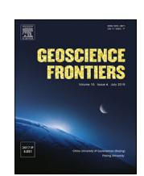
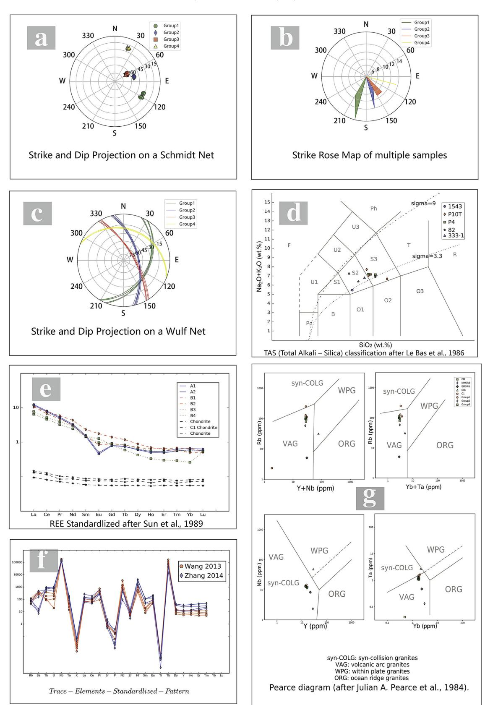
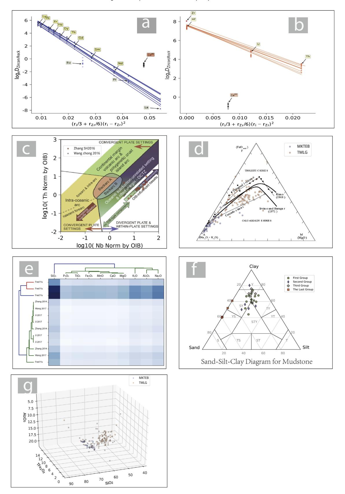

HOSTED BY Contents lists available at [ScienceDirect](www.sciencedirect.com/science/journal/16749871)

China University of Geosciences (Beijing)

# Geoscience Frontiers

journal homepage: [www.elsevier.com/locate/gsf](http://www.elsevier.com/locate/gsf)

## Research Paper

# GeoPyTool: A cross-platform software solution for common geological calculations and plots

Qiu-Ye Yu a , Leon Bagas b , Ping-Hua Yang a , Da Zhang a,\*

- a China University of Geosciences, Beijing 100083, China
- bUniversity of Western Australia, Crawley, WA 6009, Australia

## article info

#### Article history: Received 12 December 2017 Received in revised form 24 April 2018 Accepted 6 August 2018 Available online 10 August 2018 Handling Editor: Christopher J Spencer

Keywords: Python Geochemistry Structural geology Calculation Cross platform

## abstract

GeoPyTool is an open source application developed for geological calculations and plots, such as geochemical classification, parameter calculation, basic statistical analysis and diagrams for structural geology. More than acting as a link from raw data stored in Microsoft Excel (MS Excel) files to vector graphic files, GeoPyTool includes recently developed routines that have not been included in previous software, such as the calculation of the Ce(IV)/Ce(III) ratio for zircons as a method to examine the temporal evolution of oxygen fugacity in the magmatic source for igneous rocks, and the temperature calculator with titanium in zircon and zirconium in rutile. Besides these routines, GeoPyTool also allows users to load any figure from articles or books as a base map. As a Python-based crossplatform program, GeoPyTool works on Windows, MacOS X and GNU/Linux. GeoPyTool can do the whole process from data to results without the dependence of Microsoft Excel, CorelDraw and other similar software. It takes Excel XLSX and CSV (Comma Separated Value) as the formats of both the input data source files and the output calculation results files. The figures generated by GeoPyTool can be saved as portable network graphics (PNG), scalable vector graphics (SVG) or portable document format (PDF). Another highlight of GeoPyTool is the multilingual support, the official version of GeoPyTool supports both Chinese and English, and additional languages can be loaded through interface files. GeoPyTool is still in the development stage and will be expanded with further geochemical and structural geology routines. As an open source project, all source code of GeoPyTool are accessible on Github ([https://github.com/GeoPyTool/GeoPyTool\)](https://github.com/GeoPyTool/GeoPyTool). Users with Python experience can join in the development team and build more complex functions expanding the capabilities of GeoPyTool.

 2019, China University of Geosciences (Beijing) and Peking University. Production and hosting by Elsevier B.V. This is an open access article under the CC BY-NC-ND license ([http://creativecommons.org/](http://creativecommons.org/licenses/by-nc-nd/4.0/) [licenses/by-nc-nd/4.0/](http://creativecommons.org/licenses/by-nc-nd/4.0/)).

## 1. Introduction

From the dawn of modern geology, Sir Charles Lyell illustrated geological processes in his book "Principles of Geology" published in the 1830s based on detailed field observations. Since then, the use of illustrations to describe geological events has become an important part of geological research.

Fieldwork remains the foundation of the science of geology involving the observation and interpretation of features such as stratigraphic relationships, tectonic structures, structural and geochemical controls on mineralization, and geochemical analyses

E-mail address: [zhangda@cugb.edu.cn](mailto:zhangda@cugb.edu.cn) (D. Zhang).

Peer-review under responsibility of China University of Geosciences (Beijing).

of rocks. The data collected from such studies are often plotted in diagrams that help to convey the geological processes involved in the history of rocks studied, rather than using extensive text to do the same thing. The scientific community constructed these types of diagrams or plots by hand before computers were in common use.

Despite the advances in computers, time is still needed to transform the data into formats needed for further calculations and analyses. The reuse of figures from former research is also time consuming, because most figures are not presented as vector graphic files and the mathematical details on how to generate the lines and points on those figures may not be clearly given even in some high level published articles.

Fortunately, the recent software development offers some assistance in improving the efficiency of these processes.

\* Corresponding author.

## 2. Previous tools

After personal computers became available to the public in the early 1980s, software such as Geo-calc was written as an aid to calculate and display pressure-temperature-composition phase diagrams \(Brown et al., 1988). In the last decade, researchers also provided many software solutions for converting raw data to results and figures. These applications include PetroPlot \(Su et al., 2003), GCDKit (Janousek et al., 2003, 2006), PetroGraph (Petrelli et al., 2005\), Geo-Plot \(Zhou and Li., 2006\), GCDPlot (Wang et al., 2008\), GeoKit \(Lu, 2004\) and CGDK (Qiu et al., 2013). They are all powerful tools written to provide convenient ways of handling, visualization, and modeling geochemical data. GCDKit is written in the open source R language. GeoKit is written in the Visual Basic for Application (VBA) language for use in MS Excel providing several geochemistry-plotting functions. PetroGraph is a standalone application written in Visual Basic language. GeoPlot and GCDPlot were both written in VBA with increased refinement and added functionality of MS Excel \(Zhou and Li, 2006; Wang et al., 2008\). The Corel Geological Drafting Kit (CGDK, (Qiu et al., 2013) was developed using the VBA language embedded in CorelDraw to convert spreadsheet data directly into CorelDraw vector graphics files suitable for publication. Some of these applications, such as GCDKit, GeoKit and PetroGraph, are still widely used.

There is a general lack in the portability and independence of the programs mentioned above, because of the programming language used in their development. Most of these geological tools, such as GeoKit and CGDK, are written in the VBA language which can only run properly on the Windows platform and depend on particular version or commercial software (such as MS Excel and CorelDraw). GCDKit is written by the R language and can run crossplatform, but the official executable files are only provided for Windows users. In fact, there are more limitations, such as GeoKit works only on 32-bit version of MS Excel and CGDK only works with outdated versions of CorelDraw.

Another issue is the inconvenience to update functions. GeoKit and other similar VBA based tools only provide prebuilt base maps and templates, which means that users can only use these built-in functions. CGDK allow users to import user-defined base maps and templates, but the process of building these base maps and templates from new research requires both installation and complicated operations of CorelDraw.

A further limitation of the above mentioned tools is the lack of public participation in the development. Most of such tools are written by a small group of people, and the source code of those applications are not accessible by the public. Over time, some software has lost its maintenance and is no longer able to run on current mainstream platforms. For example, CGDK [\(https://github.](https://github.com/midimyself/CGDK) [com/midimyself/CGDK\)](https://github.com/midimyself/CGDK) hasn't been updated since 2012.

In conclusion, previous tools provided handy solutions, but there are still some problems that need to be solved, such as the platform dependency, the dependence on other software, the lack of new methods and public participation.

## 3. Solution

To solve the problems outlined above, new applications should be platform independent, not rely on other software, and be easy to extend with new routines.

A cross-platform programing language is needed to solve the portability problem. The lack of portability across operating systems can be remedied using Python, a computer language, originally released by Van Rossum \(1991, 1995\), with simple syntax, abundant online resources and a rich ecosystem of scientifically focused toolkits with a heavy emphasis on community. Python is supported by Microsoft Windows, GNU/Linux, Mac OSX, and has become a popular programming language for its easy syntax (Perkel, 2015). This makes Python portable across popular platforms providing the same functions in each of the platforms without the need to re-coded for the specific platform.

Using Python language is a practical choice, as done by Beyreuther et al. \(2010\) and Krieger and Peacock \(2014\), who wrote the ObsPy and Mtpy modules in Python used for graphing geophysical data. Their works inspired the GeoPyTool project to incorporate Python modules into a stand-alone application, which runs on different operating systems, completes all tasks without dependence on other software such as MS Excel or CorelDraw.

The most important reason to choose Python is its flexibility and capability of numerical analysis, data analysis and visualizations. Numpy, a fast tool for algebra related usages, pandas, a powerful tool to manage data sheets, matplotlib, a widely used module for data visualization, they and other powerful modules together make Python a versatile programming language.

Table 1 lists some previous programs used to plot geochemical data on various types of diagrams. Functions, limitations and deficiencies of these previous applications are included here as a comparison to what GeoPyTool can already do.

As shown in Table 2, prebuilt functions currently provided by GeoPyTool contain some widely used basic and traditional routines, such as TAS diagram, REE and trace elements spider diagram, stereographic projection, CIPW normalization of multiple samples, and a basic instance of hierarchical clustering analysis. GeoPyTool also contains some recently developed methods, such as the calculation of the Ce(IV)/Ce(III) ratio of zircon in porphyry to infer relative oxygen fugacity and the calculation of titanium in zircon and zirconium in rutile as crystallization thermometers \(Watson et al., 2006). Users can use external PNG, JPG, or SVG images as based maps. The amount of functions will increase in the future, given the flexibility of Python and the interaction with the community.

## 4. Installation

The recommended installation method is to download the packed executable file and run the application directly. The

Table 1 Previous software tools and deficiencies.

| Tools               | Author                                | Significance                                                                         |     | Language Deficiency                                          |
|---------------------|---------------------------------------|--------------------------------------------------------------------------------------|-----|--------------------------------------------------------------|
| PetroPlot           | Su et al., 2003                    | Cross platform, can be operated with a PC or Mac installed with MS Excel 97 |     | Unknown Not updated and not maintained for a long time |
| GCDKit              | Janou sek et al., 2003, 2006 | Powerful geochemistry tools powered by the R language                       | R   | The official binary files work on Windows only         |
| PetroGraph Petrelli | et al., 2005                          | Free software that provides comprehensive functions for geochemistry     | VB  | Work on Windows only and use some private file formats |
| GeoPlot             | Zhou and Li, 2006                  | Built with VBA using MS Excel, small but functional                            | VBA | Work on Windows only and relies on the MS Excel or     |
| GCDPlot             | Wang et al., 2008                  |                                                                                      |     | CorelDraw to be operational                               |
| GeoKit              | Lu, 2004                              | Plotting and calculation using MS Excel 32-bit, still being updating        |     |                                                              |
| CGDK                | Qiu et al., 2013                   | Excellent graphic functions powered by VBA in CorelDraw                        |     |                                                              |

 Table 2

 Prebuilt functions in GeoPyTool. The functions shown are those presently available in the latest version of GeoPyTool, more powerful functions are under development.

| Type                                  | Functions                                      | Brief description                                                                                                                                                                                                                                         | Reference                                                                              |
|---------------------------------------|------------------------------------------------|-----------------------------------------------------------------------------------------------------------------------------------------------------------------------------------------------------------------------------------------------------------|----------------------------------------------------------------------------------------|
| Geochemistry                          | TAS plot                                       | Volcanic or intrusive rocks classification with $\text{SiO}_2$ and $(\text{Na}_2\text{O} + \text{K}_2\text{O})$ . Both the generated figure and the classification                                                                                        | Maitre et al., 1989; Middlemost, 1994                                                  |
|                                       | QAPF plot                                      | results are presented Plutonic or volcanic rocks classification with Q (quartz), A (alkali feldspar), P (plagioclase) and F (feldspathoid)                                                                                                                | Maitre et al., 2004                                                                    |
|                                       | REE                                            | Compare rare earth elements with standard samples as spider diagram to analyze the distribution, tendency and anomalies. Both the generated figure and some related calculation results are available to export                            | Boynton, 1984                                                                          |
|                                       | Trace elements                                 | Compare trace elements with standard samples as spider diagram to analyze the distribution, tendency and anomalies                                                                                                                                        | Sun and Mcdonough, 1989                                                                |
|                                       | Rb-(Y+Nb), Rb-(Yb+Ta), Nb-Y, and Ta-Yb plots   | Tectonic settings classification with Y  -Nb, Yb-Ta, Rb-(Y + Nb) and Rb  -(Yb + Ta) for granites                                                                                                                                                          | Pearce et al., 1984                                                                    |
| Structural geology                    | Stereographic projection and rose diagram      | Virtualization and basic analyzation of outcrop occurrence; distribution, tendency and anomalies as a rose diagram with stereographic projection on Wulf net and Schmidt net                                                                  | Zhou et al., 2003                                                                      |
|                                       | QFL and QmFLt plots                            | "Triangular QFL and QmFLt compositional diagrams for plotting point counts of sandstones can be subdivided into fields that are characteristic of sandstone suites derived from the different kinds of provenance terranes controlled by plate tectonics" | Dickinson et al., 1983                                                                 |
| arameter calculation                  | CIPW normalization                             | CIPW norm calculation with multiple samples. The calculation results are presented as a table sheet which can be saved as CSV or Excel file. The results can                                                                                     | Johannsen, 1939; Washington, 1917; CIPW norm Excel spreadsheet by Kurt Hollocher |
|                                       | Zircon Ce (IV) /Ce (III) | also be used for QAPF diagram directly Allow users to calculate Ce (IV) /Ce (III) ratio in zircon to infer relative oxidation state in a wide range of intermediate to felsic igneous rocks                             | Ballard et al., 2002                                                                   |
|                                       | Zircon and rutile thermometers                 | Allow users to use Ti element in zircon and Zr element in rutile to calculate the temperature of crystallization                                                                                                                                    | Watson et al., 2006                                                                    |
| Statistical analyses and data fitting | Cluster                                        | A basic version of hierarchical clustering analyzation of different number valued items. Allow users to find out a basic clue on the relationship of different items in their data                                                            | Original functions                                                                     |
|                                       | User defined X—Y diagram                       | Allow users to choose any two columns of data to draw a X—Y scatter plot as a vectorial figure, which can contain any other picture as base map and can show contour map and fitted polynomial curve of the chosen data                                   |                                                                                        |
|                                       | User defined X–Y–Z diagram                     | Allow users to choose any three columns of data to draw a triangular plot as a vectorial figure, which also allow users to load any other picture as base map                                                                                    |                                                                                        |
|                                       | Statistical description and 3D visualization   | Allow users to get statistical result of multiple items as a table sheet and choose any three columns of data to generate a 3D scatter diagram                                                                                                   |                                                                                        |

standalone GeoPyTool application is temporarily only provided for mainstream Microsoft Windows (since 7) and macOS (since Sierra). The download links of the applications for each operating system can be accessed from the website of GeoPyTool (http://geopytool.com/download.html). After unzipping and the installation of patches for some particular version of operating system, GeoPyTool can be run by double clicking on the executable file. On Windows 8/8.1/10 and macOS, no system patches are needed.

The second approach is to import GeoPyTool as a Python module and run it under a Python3 interpreter. This requires the installation of Python3 because that GeoPyTool is developed only for Python3. Users of macOS may use Homebrew to install a local version of Python3, users of GNU/Linux or BSD operating systems can use the package managers built-in their systems to install Python3. There is a detailed instruction for installation on different operating systems on the website of GeoPyTool (http://geopytool.com/installation-expert.html).

#### 5. Usage

## 5.1. Data files

GeoPyTool uses MS Excel® XLSX and CSV (Comma Separated Value) files as input data files. The MS Excel® XLSX format is chosen of its widespread use and multiple features. The CSV format is used as a transfer format that can be accessed and edited with various software besides MS Excel®, including almost all modern text editors such as Vim and Notepad.

GeoPyTool's data input functions are based on Pandas, which is a Python module that reads XLSX and CSV files. The calculation functions of GeoPyTool are based on NumPy, a numerical module used for a basic mathematical function. The drawing and plotting functions are based on Python's Matplotlib module for data visualization. After reading data, and the completion of calculations and plotting, the mathematical results are written as CSV files using the xlrd module.

The data files need to follow pattern of the template files provided with GeoPyTool, which can be downloaded from https:// github.com/GeoPyTool/GeoPyTool/blob/master/DataFileSamples. zip?raw=true. As shown in these templates, besides geochemical or structural data, there is some additional information that needs to be added to the data file and set up properly, after which the calculations can be completed and the diagrams can be plotted. The information needed includes all the required headings which need to be manually entered. These have the headings: "Label" for the legend; "Marker" for the shape of the points; "Size" for the size of the point shape used; "Style" for the style of the lines; "Width" for the width of the lines: "Color" of both the points and lines: and "Alpha" for the transparency of the points and lines. The selectable items of Marker, Style and Color and the corresponding effects are illustrated in Appendix Tables A1-A3 where a sample data file is also located. An example of the use of the headings is presented in Table 3 with assay values included as raw data and other columns containing the additional setting up information.

A detailed instruction of how to set up data can be found on the website of GeoPyTool (http://geopytool.com/demonstration.html).

### 5.2. Traditional routines

As outlined above, GeoPyTool includes traditional routines, recently developed routines, and flexible self-defined functions (Table 2). These functions are briefly discussed below.

**Table 3**TAS data (wt.%) sample for GeoPyTool.

| Author       | Label          | Marker | Color | Size | Alpha | SiO 2 | Na 2 O | K 2 O |
|--------------|----------------|--------|-------|------|-------|------------------|-------------------|------------------|
| Wang Jianjun | Wang, 2013     | d      | blue  | 20   | 0.6   | 69.85            | 1.657             | 3.825            |
|              | Wang, 2013     | d      | blue  | 20   | 0.6   | 53.19            | 2.531             | 5.508            |
|              | Wang, 2013     | d      | blue  | 20   | 0.6   | 58.76            | 5.804             | 4.446            |
|              | Wang, 2013     | d      | blue  | 20   | 0.6   | 55.92            | 4.585             | 3.593            |
| Zhang Chao   | Zhang, 2014    | S      | grey  | 20   | 0.6   | 70.24            | 4.94              | 4.81             |
|              | Zhang, 2014    | S      | grey  | 20   | 0.6   | 72.41            | 4.68              | 3.68             |
|              | Zhang, 2014    | S      | grey  | 20   | 0.6   | 73.91            | 3.63              | 4.4              |
|              | Zhang, 2014    | S      | grey  | 20   | 0.6   | 74.33            | 3.89              | 4.71             |
| Wang Jianjun | TM-Wang, 2013  | 0      | red   | 20   | 0.6   | 51.41            | 6.245             | 1.661            |
|              | TM-Wang, 2013  | 0      | red   | 20   | 0.6   | 60.87            | 1.608             | 7.331            |
|              | TM-Wang, 2013  | 0      | red   | 20   | 0.6   | 60.59            | 8.136             | 1.844            |
| Zhang Yu     | TM-Zhang, 2005 | ^      | green | 20   | 0.6   | 58.02            | 4.63              | 2.7              |
|              | TM-Zhang, 2005 | ^      | green | 20   | 0.6   | 55.72            | 3.5               | 1.8              |
|              | TM-Zhang, 2005 | ^      | green | 20   | 0.6   | 54.38            | 4.33              | 2.65             |
|              | TM-Zhang, 2005 | ^      | green | 20   | 0.6   | 59.72            | 6.02              | 1.3              |
| Zhao         | TM-Zhao, 2011  | *      | black | 20   | 0.6   | 57.23            | 4.13              | 2.35             |
| Zhonghua     | TM-Zhao, 2011  | *      | black | 20   | 0.6   | 52.25            | 3.59              | 1.7              |
|              | TM-Zhao, 2011  | *      | black | 20   | 0.6   | 58.37            | 3.99              | 3.17             |
|              | TM-Zhao, 2011  | *      | black | 20   | 0.6   | 53.01            | 3.94              | 2.4              |

#### 5.2.1. Sedimentary and structural geology

Sedimentary geology related methods contain QFL and QmFLt plots of Dickinson et al. (1979, 1983), using the components of sandstone samples to delineate tectonic settings. Structural geology related routines contain stereographic polar projection (Sohon, 1941) of structural measurements such as dip direction and angle of outcrops, including Wulf net projection, Schmidt net projection and rose diagram (Zhou et al., 2003). Appendix Table 1 includes strike direction, dip direction and dip angle as sample data that are used to generate Fig. 1a—c.

## 5.2.2. Geochemistry

Geochemistry related functions include rock-type classification. Igneous rocks are classified on TAS and QAPF graphs (Maitre et al., 1989, 2004; (Middlemost, 1994). An example of a TAS diagram using the data in Table 3 is shown in Fig. 1d. REE (rare earth elements) and trace elements spider diagrams (Boynton, 1984; (Sun and Mcdonough, 1989) are also available in GeoPyTool, and the default standard values are from Sun and Mcdonough (1989). An example of an REE spider diagram plotted with GeoPyTool using the data in Table 4 is shown in Fig. 1e. The second example here is a trace elements spider diagram, which uses the data in Table 5, which generates the plot in Fig. 1f. There are two different orders of the trace elements used in the normalized spider diagram of Geo-PyTool. The first is the Cs-Lu sequence that contains 37 elements, including Cs, Tl, Rb, Ba, W, Th, U, Nb, Ta, K, La, Ce, Pb, Pr, Mo, Sr, P, Nd, F, Sm, Zr, Hf, Eu, Sn, Sb, Ti, Gd, Tb, Dy, Li, Y, Ho, Er, Tm, Yb, Lu. Another is the Rb-Lu sequence, which contains 27 elements, including Rb, Ba, Th, U, Nb, Ta, K, La, Ce, Pr, Sr, P, Nd, Zr, Hf, Sm, Eu, Ti, Tb, Dy, Y, Ho, Er, Tm, Yb, Lu.

Another geochemistry related function is the diagram of Rb vs. (Y + Nb), Rb vs. (Yb + Ta), and Ta vs. Yb plots from Pearce et al. (1984), using the geochemistry of igneous samples to delineate tectonic settings. An example is the Rb vs. (Y + Nb) diagram (Fig. 1g) generated based on Table 6.

## 5.2.3. CIPW calculation

GeoPyTool includes a CIPW normalization routine (Verma et al., 2003). The CIPW norm calculation can be done for multiple geochemical analyses listed in the default "CIPW.xlsx" file. The calculated results are included in four CSV files showing results as weight percentage, volume percentage, and molecule percentage with several useful parameters such as  $Fe^{3+}/Fe^{T}$ ,  $Mg/(Mg+Fe^{T})$ ,  $Mg/(Mg+Fe^{2+})$  and Ca/(Ca+Na) ratios for rocks,  $Mg/(Mg+Fe^{2+})$  ratios for silicates, albite to anorthite contents, and the differentiation index of a magma.

## 5.3. Newly developed routines

## 5.3.1. $Ce^{(IV)}/Ce^{(III)}$ ratio in zircon

 $Ce^{(IV)}/Ce^{(III)}$  ratio in zircons can estimate relative oxygen fugacity for intermediate to felsic igneous rocks (Ballard et al., 2002), including porphyry deposits (e.g. (Xin and Qu, 2008; Han et al., 2013). Zircon is a widespread accessory mineral, in which  $Ce^{(IV)}$  is partitioned into zircon in strong preference to  $Ce^{(III)}$  because of the identical charge and similar size in eight-fold coordination (0.97 A) of  $Ce^{(IV)}$  to Zr (r=0.84 A), similar to other tetravalent elements such as Hf, U and Th. That makes  $Ce^{(IV)}/Ce^{(III)}$  ratio as a potential measure of magmatic oxidation state.

To estimate  $Ce^{(IV)}/Ce^{(III)}$  ratio in zircon, there are four values needed. The first is the concentrations of Ce in zircon, which can be measured directly by in-situ chemical analysis of zircon. The second is the concentrations of Ce in melt, which can be assumed equivalent to the whole-rock concentration of Ce. The third one, zirconmelt distribution coefficients of  $Ce^{(III)}$ , can be estimated by fitting

Figure 1. Figures generated by GeoPyTool (Part 1). (aec) Stereographic projection diagram, (a) Schmidt net, (b) Rose diagram, (c) Wulf net, data from Appendix Table 1; (d) TAS diagram for volcanic rocks (after (Wilson et al., 1989), data from Table 3; (e) Rare earth elements spider diagram, data from Table 4; (f) Trace element spider diagram, data from Table 5; (g) Pearce diagram, data from Table 6.

Table 4 REE data (ppm) sample for GeoPyTool.

| Label | Color | Marker | Size | Alpha | Style | Width | La   | Ce    | Pr   | Nd    | Sm   | Eu   | Gd   | Tb   | Dy   | Ho   | Er   | Tm   | Yb`  | Lu   | Author    |
|-------|-------|--------|------|-------|-------|-------|------|-------|------|-------|------|------|------|------|------|------|------|------|------|------|-----------|
| A1    | blue  | o      | 20   | 0.6   | -     | 1     | 31.1 | 60.91 | 7.08 | 24.15 | 4.15 | 0.51 | 2.98 | 0.51 | 2.81 | 0.57 | 1.63 | 0.29 | 2.03 | 0.29 | Qiu-ye Yu |
| A1    | blue  | o      | 20   | 0.6   | -     | 1     | 29.4 | 57.47 | 6.63 | 22.43 | 3.82 | 0.46 | 2.91 | 0.5  | 2.73 | 0.53 | 1.46 | 0.26 | 1.83 | 0.26 | Qiu-ye Yu |
| A1    | blue  | o      | 20   | 0.6   | -     | 1     | 26.8 | 50.41 | 6.22 | 22.98 | 3.95 | 0.86 | 3.31 | 0.56 | 3.19 | 0.68 | 1.96 | 0.31 | 2.01 | 0.26 | Qiu-ye Yu |
| A1    | blue  | o      | 20   | 0.6   | -     | 1     | 26.2 | 58.71 | 7.73 | 31.79 | 6.13 | 1.81 | 5.17 | 0.8  | 4.04 | 0.74 | 1.83 | 0.27 | 1.54 | 0.24 | Qiu-ye Yu |
| A1    | blue  | o      | 20   | 0.6   | -     | 1     | 16.2 | 34.68 | 4.28 | 17.9  | 3.77 | 1    | 3.36 | 0.56 | 2.96 | 0.59 | 1.58 | 0.26 | 1.74 | 0.25 | Qiu-ye Yu |
| A1    | blue  | o      | 20   | 0.6   | -     | 1     | 19.5 | 38.77 | 5.21 | 21.56 | 3.83 | 1.3  | 3.01 | 0.4  | 1.94 | 0.35 | 0.9  | 0.13 | 0.79 | 0.24 | Qiu-ye Yu |

Table 5 Trace elements (ppm) data sample for GeoPyTool.

| P     | Nd   | Zr    | Hf    | Sm    | Eu    | Ti   | Tb        | Dy    | Y     | Ho   | Er   | Tm   |
|-------|------|-------|-------|-------|-------|------|-----------|-------|-------|------|------|------|
| 186   | 620  | 23    | 103   | 2.93  | 3.95  | 0.86 | 4171.3368 | 3.19  | 17.6  | 0.68 | 2.01 | 0.3  |
| 232   | 1594 | 31.8  | 119   | 3.19  | 6.13  | 1.81 | 6292.965  | 4.04  | 18.1  | 0.74 | 1.54 | 0.2  |
| 251   | 685  | 18    | 59    | 1.94  | 3.05  | 0.82 | 2828.8376 | 1.68  | 8.4   | 0.33 | 0.8  | 0.12 |
| 73    | 432  | 18.3  | 42    | 1.23  | 3.32  | 0.73 | 1654.1508 | 2.32  | 11.9  | 0.46 | 1.17 | 0.16 |
| 24.6  | 345  | 11.18 | 170.8 | 8.12  | 2.48  | 0.13 | 2577.119  | 3.44  | 20.75 | 0.78 | 3.15 | 0.6  |
| 13.6  | 210  | 41.62 | 412   | 16.73 | 10.51 | 0.77 | 2277.454  | 10.7  | 51.94 | 2.11 | 7.09 | 1.21 |
| 222.1 | 297  | 62.11 | 426.1 | 16.48 | 12.43 | 1.13 | 1558.258  | 8.58  | 38.45 | 1.56 | 4.64 | 0.78 |
| 35.5  | 279  | 29.55 | 422.7 | 17.29 | 7.7   | 0.58 | 1438.392  | 10.53 | 52.49 | 2.17 | 7.19 | 1.22 |
| 450   | 44   | 30.97 | 232.2 | 7.45  | 5.21  | 0.97 | 539.397   | 3.46  | 17.04 | 0.65 | 2.32 | 0.47 |

line of the zircon-melt trivalent REE array. The last one, zircon-melt distribution coefficients for Ce(IV) can be estimated similarly by fitting tetravalent (ZreHfeUeTh) trend \(Ballard et al., 2002). As a sample, the REE data of zircons and its hosting rock measured by Ballard are included in the data file shown in Table 7. The fitted lines are shown in Fig. 2a and b, and the calculation results are stored in a data sheet \(Table 8).

## 5.3.2. Zircon and rutile thermometers

Zircon and rutile thermometers use titanium in zircon and zirconium in rutile to calculate the temperature of crystallization \(Watson et al., 2006; Ferry and Watson, 2007\). Table 9 is a data sample for these two functions, in which Ti and Zr are all elemental concertation (in ppm) and aSiO2 and aTiO2 are activity (M/g) of the respective components. The calculated results are also stored in Table 9.

## 5.4. Extended functions

The functions outlined above satisfy common tasks performed geologists, but specialist plots can be defined in GeoPyTool by adjusting the codes. Besides, GeoPyTool provides two functions for users to build additional plots, and both two functions allow users to load existing figures from other research as base maps. These two functions are the XeY scatter plot and the ternary scatter plot.

Table 6 Data sample for Pearce diagram in GeoPyTool (after Pearce et al., 1984\).

| Label  | Author    | Marker | Color | Size | Alpha | Style | Width | Rb  | Nb   | Ta   | Y    | Yb   |
|--------|-----------|--------|-------|------|-------|-------|-------|-----|------|------|------|------|
| Group1 | Qiu-ye Yu | o      | red   | 50   | 0.5   | -     | 1     | 111 | 14.7 | 1.64 | 15.4 | 2.03 |
| Group1 | Qiu-ye Yu | o      | red   | 50   | 0.5   | -     | 1     | 128 | 13.5 | 1.31 | 14   | 1.83 |
| Group1 | Qiu-ye Yu | o      | red   | 50   | 0.5   | -     | 1     | 249 | 13.5 | 1.51 | 14.5 | 1.77 |
| Group2 | Qiu-ye Yu | d      | blue  | 50   | 0.5   | -     | 1     | 58  | 13   | 1.33 | 13.7 | 1.68 |
| Group2 | Qiu-ye Yu | d      | blue  | 50   | 0.5   | -     | 1     | 95  | 12.8 | 1.25 | 14.2 | 1.7  |
| Group3 | Qiu-ye Yu | s      | green | 50   | 0.5   | -     | 1     | 97  | 12.7 | 1.1  | 14.3 | 1.7  |
| Group3 | Qiu-ye Yu | s      | green | 50   | 0.5   | -     | 1     | 78  | 12   | 1.1  | 16.1 | 1.85 |
| Group3 | Qiu-ye Yu | s      | green | 50   | 0.5   | -     | 1     | 102 | 11.6 | 1.1  | 16   | 1.82 |
| Group3 | Qiu-ye Yu | s      | green | 50   | 0.5   | -     | 1     | 97  | 11.3 | 1.06 | 16   | 1.79 |
| Group3 | Qiu-ye Yu | s      | green | 50   | 0.5   | -     | 1     | 93  | 12.2 | 1.22 | 16.7 | 1.85 |
| Group3 | Qiu-ye Yu | s      | green | 50   | 0.5   | -     | 1     | 111 | 12.8 | 1.11 | 14.6 | 1.67 |

Table 7 REE data (ppm) measured from the zircons and the corresponding hosting rock from Ballard et al. \(2002\).

| Tb    | Dy     | Ho    | Er     | Tm    | Yb     | Lu     | Th     | U      | Hf       | Zr     | Ce(IV) |
|-------|--------|-------|--------|-------|--------|--------|--------|--------|----------|--------|--------|
| 0.63  | 4.04   | 0.79  | 2.24   |       | 2.3    | 0.34   | 16.88  | 4.61   | 5.47     | 156.88 | 52.79  |
| 11.60 | 130.34 | 47.15 | 215.53 | 43.87 | 385.83 | 72.89  | 539.94 | 541.37 | 8963.76  | 497555 | 27.99  |
| 9.53  | 107.17 | 38.93 | 174.98 | 35.56 | 308.15 | 57.26  | 338.94 | 364.63 | 8080.83  | 497555 | 21.34  |
| 19.45 | 206.70 | 69.08 | 286.82 | 55.15 | 454.09 | 79.07  | 484.74 | 393.02 | 7217.99  | 497555 | 19.13  |
| 11.48 | 139.43 | 55.29 | 269.67 | 57.73 | 525.45 | 102.78 | 398.75 | 602.75 | 8149.73  | 497555 | 25.09  |
| 12.81 | 150.39 | 57.66 | 276.50 | 57.80 | 517.10 | 97.44  | 588.23 | 626.55 | 7499.11  | 497555 | 25.01  |
| 12.37 | 137.31 | 49.03 | 212.55 | 42.43 | 374.05 | 68.88  | 281.79 | 323.72 | 8070.96  | 497555 | 15.37  |
| 7.50  | 87.50  | 33.29 | 155.99 | 33.02 | 307.70 | 59.69  | 226.99 | 358.03 | 9970.61  | 497555 | 18.26  |
| 18.89 | 208.57 | 72.44 | 314.06 | 61.52 | 525.02 | 93.69  | 455.81 | 433.04 | 9065.15  | 497555 | 19.60  |
| 17.93 | 201.96 | 73.22 | 327.37 | 64.75 | 560.63 | 102.45 | 583.66 | 604.38 | 10272.77 | 497555 | 24.96  |

Figure 2. Figures generated by GeoPyTool (Part 2). (a and b) Ce(IV)/Ce(III) in zircons fitting, data from Table 7 and results in Table 8 \(Ballard et al., 2002\); (c) XeY diagram with loading data from Saccani \(2015\); (d) Standard AFM (alkali/iron/magnesium) diagram, data from Appendix Table 2; (e) Hierarchical-cluster analysis result, data from Table 10; (f) Sandstone classification diagram, data from Table 11; (g) 3D data visualization, data from Appendix Table 2.

**Table 8**Zircon Ce(IV)/Ce(III) ratio calculation results.

| Zircon sample label | Ce (IV) /Ce (III) ratio | Melt Ce (IV) /Ce (III) ratio | δCe (IV) | $\delta Ce^{(III)}$ | $\delta Ce_{zircon-melt}$ |
|---------------------|-----------------------------------------------|----------------------------------------------------|---------------------|---------------------|---------------------------|
| 521-02              | 61.79889722                                   | 0.001232016                                        | 423.5013882         | 0.008453462         | 0.530214056               |
| 521-03              | 58.05260372                                   | 0.001179402                                        | 336.941716          | 0.00685356          | 0.404243228               |
| 521-04              | 16.34395639                                   | 0.000945936                                        | 360.9819881         | 0.020913473         | 0.362379238               |
| 521-05              | 95.69684722                                   | 0.001188232                                        | 395.8473997         | 0.004920996         | 0.475279409               |
| 521-06              | 69.0401203                                    | 0.0010945                                          | 426.6717484         | 0.006771591         | 0.47376397                |
| 521-07              | 31.03602641                                   | 0.000898618                                        | 313.8789252         | 0.009096494         | 0.291153628               |
| 521-08              | 97.60191488                                   | 0.001056602                                        | 324.0454082         | 0.003511744         | 0.345898844               |
| 521-09              | 18.03596016                                   | 0.000908366                                        | 387.2451078         | 0.019522001         | 0.37128244                |
| 521-10              | 25.08261895                                   | 0.000990526                                        | 459.019971          | 0.018145633         | 0.472816821               |

**Table 9**Zr titanium data sample (ppm) used in zircon rutile temperature calculator and the results (°C).

| Ti (ppm) | $\alpha SiO_2$ (activity, M/g) | $\alpha TiO_2$ (activity, M/g) | Zr (ppm) | Temp Max (°C) | Temp Mid (°C) | Temp Min (°C) |
|----------|--------------------------------|--------------------------------|----------|---------------|---------------|---------------|
| 5.37     | 1                              | 1                              | 12565    | 722.1595144   | 690.9579544   | 659.7563944   |
| 11.4     | 1                              | 1                              | 89525    | 793.1744305   | 758.7326019   | 724.2907733   |
| 8.21     | 1                              | 1                              | 5457     | 760.99918     | 728.0416835   | 695.084187    |
| 3.3      | 1                              | 1                              | 3084     | 681.0562887   | 651.6701623   | 622.2840359   |

#### 5.4.1. X-Y scatter plot and ternary diagram

The X—Y scatter plot function supports plotting data as points on a X—Y rectangular plane coordinate system. Both the X and Y items of the plot can be selected from the data file, and they can also be set to the logarithmic function of the chosen items. These selected data can also be normalized with OIB (average ocean island basalt), N-MORB (normal middle ocean ridge basalt), EMORB (enriched middle ocean ridge basalt), and PM (primitive mantle) (Sun and (Mcdonough, 1989).

Fig. 2c is an example of the X–Y plot. The X-axis and Y-axis are respectively the logarithmic values of Nb and Th, both normalized by OIB (average ocean island basalt). The base map of this diagram, shown in Fig. 2c (from (Saccani, 2015), is loaded by clicking on the Load button and choose the corresponding picture. After loading the picture, the left, right, upper and lower boundaries of the picture need to be filled in the four blanks to justify the right mathematic location of the base map. In this example, the left, right, top and bottom boundaries are -2, 2, -2 and 3.

Ternary diagram in GeoPyTool, also known as X-Y-Z plot, also allow users to load other ternary figures as base map. Fig. 2d is an AFM (A: Na2O + K2O, F: FeO + Fe2O3, M: MgO) diagram as an example.

#### 5.4.2. Hierarchical clustering

GeoPyTool contains a basic function of hierarchical clustering, also called hierarchical cluster analysis (HCA), which is a well-established

and commonly used technique in unsupervised machine learning (Müllner, 2011). HCA is a clustering method that begins with regarding each element as a separate cluster and gradually merge them into larger clusters. In each step of this clustering progress, it finds the pair of clusters with least distance and merges them into a new parent cluster. This process continues until there comes the only one cluster. The result of this clustering could be shown as a dendrogram, which is a tree structure plot (Liu et al., 2012).

The HCA function in GeoPyTool takes data from imported Excel or CSV files, transfers the number valued items into a matrix, and calculates the correlation matrices of the transferred matrix and its inverse matrix. The correlation matrices are used as the measurement of the Euclidean distance between original data's different rows and between its columns. The HCA clustering result and the combined correlation matrix are assembled together as a figure shown in Fig. 2e. The source data for this figure is in Table 10. The data imported is treated as a two-dimensional matrix, in which each row/column is a one-dimensional vector. The Correlation-Matrix-Based Hierarchical Clustering Method (CMBHC) is used in GeoPyTool to achieve the HCA function (Liu et al., 2012).

The CMBHC method, as its name says, uses the correlation matrix for related statistical calculations.

Its first step is calculating the correlation matrix, formed by Pearson's correlation coefficients between any two row/column

**Table 10**Data sample used for cluster function in GeoPyTool (wt.%).

| Label             | $Al_2O_3$   | CaO         | K 2 O | MgO         | MnO         | Na 2 O | P 2 O 5 | SiO 2 | Fe 2 O 3 | TiO 2 |
|-------------------|-------------|-------------|------------------|-------------|-------------|-------------------|-------------------------------|------------------|--------------------------------|------------------|
| Fred Yu           | 20.98899638 | 3.716281129 | 4.445551351      | 1.588410483 | 0.062650889 | 5.804191764       | 0.156712422                   | 58.76119786      | 2.587421576                    | 0.472012344      |
| Fred Yu           | 16.44347356 | 7.70343199  | 5.508258758      | 3.302922687 | 0.192241076 | 2.53054692        | 0.36488603                    | 53.19229952      | 5.477794632                    | 1.049542323      |
| Fred Yu           | 14.96976596 | 6.093170459 | 3.593148693      | 3.653877966 | 0.173581657 | 4.585060163       | 0.099263941                   | 55.92153951      | 4.777400946                    | 0.275836253      |
| Fred Yu           | 13.14262935 | 3.453830785 | 3.825318398      | 2.921699879 | 0.090332551 | 1.656633952       | 0.141924801                   | 69.84971154      | 2.971913518                    | 0.696125847      |
| Ji, 2017          | 15.64       | 2.56        | 4.24             | 1.13        | 0.08        | 4.08              | 0.16                          | 66.7             | 4.9299985                      | 0.46             |
| Ji, 2017          | 15.22       | 1.12        | 4.09             | 0.65        | 0.09        | 5.06              | 0.11                          | 69.51            | 3.6777765                      | 0.42             |
| Ji, 2017          | 14.87       | 1.48        | 3.85             | 0.63        | 0.06        | 3.82              | 0.17                          | 67.98            | 4.6633325                      | 0.58             |
| Ji, 2017          | 14.71       | 1.33        | 5.21             | 0.35        | 0.09        | 4.51              | 0.05                          | 70.44            | 1.8677775                      | 0.34             |
| Wang et al., 2017 | 15.13       | 1.34        | 3.85             | 0.64        | 0.05        | 4.71              | 0.01                          | 70.14            | 2.4177769                      | 0.36             |
| Wang et al., 2017 | 12.55       | 0.2         | 4.3              | 0.17        | 0.04        | 3.12              | 0.01                          | 76.83            | 0.792222                       | 0.15             |
| Zhang, 2014       | 14.75       | 0.47        | 4.16             | 0.36        | 0.039       | 5.17              | 0.064                         | 71.66            | 2.1088879                      | 0.35             |
| Zhang, 2014       | 15.74       | 0.12        | 4.39             | 0.26        | 0.028       | 0.6               | 0.028                         | 74.16            | 1.6877774                      | 0.25             |
| Zhang, 2014       | 15.63       | 0.23        | 6.18             | 0.2         | 0.044       | 4.5               | 0.105                         | 69.22            | 2.565555                       | 0.64             |

vectors u and v. For one-dimensional vectors, this calculation is shown in Eq. (1).

$$cc(u,v) = \frac{\sum u_i v_i - \sum u_i \sum v_j}{\sqrt{\sum u_i^2 - (\sum u_i)^2} \sqrt{\sum v_j^2 - (\sum v_j)^2}}$$
(1)

The Euclidean distances between each two of those vectors are needed to process the HCA. Then there comes the need of Eq. (2) to calculate the distance d between the row/column vectors u and v.

$$d(u,v) = 1 - cc(u,v) = 1 - \frac{\sum u_i v_i - \sum u_i \sum v_j}{\sqrt{\sum u_i^2 - (\sum u_i)^2} \sqrt{\sum v_j^2 - (\sum v_j)^2}}$$
(2)

Briefly speaking, the correlation matrix is calculated firstly, with which the distance matrix can be calculated and used for the HCA process. It is clear that HCA function needs to perform matrix calculations, so there are mathematically limitations. If there are any blank items in the data, or if the data matrix is a singular matrix, HCA won't be possible.

At the code level, this program uses SciPy to complete the calculation process (Oliphant, 2007). This article only describes the main idea instead of the specific calculation process, which can be seen in code, at <a href="https://github.com/GeoPyTool/GeoPyTool/blob/master/geopytool/Cluster.py">https://github.com/GeoPyTool/GeoPyTool/blob/master/geopytool/Cluster.py</a>.

Specifically, take Table 10 as an example, in which horizontal rows and vertical columns are respectively considered as comparative indexes. Each row is considered as a one-dimensional vector. Euclidean distances between each two rows is used for the clustering of left dendrogram shown in Fig. 2e. Similar process for each column generates the dendrogram in the upper part of Fig. 2e. The left dendrogram and the clustering for horizontal rows can be used to separate ungrouped data into several groups, or to estimate the dissimilarity of different rows. The upper dendrogram and the

clustering for vertical columns can be used to evaluate correlation between different oxides or elements. The colored matrix in the middle of Fig. 2e is a combination of the correlation matrix of rows and columns.

Data in Table 10 contain different samples of a same volcanic rock. It can be seen from Fig. 2e that these samples can be divided into two groups by HCA, and  $SiO_2$  and other oxides is significantly dissimilar, which hints that there may be other sources of ingredients that affect the silica content.

## 5.4.3. Developing functions

Besides the routines mentioned above, new functions have been added, including a clay-silt-sand classification diagram (Fig. 2f and data in Table 11), a 3D visualization function (Fig. 2g), and an Auto function to generate all available calculations and plots for imported data. GeoPyTool is still in development, more functions will be gradually added.

## 5.5. Output files

GeoPyTool generates MS Excel XLSX and CSV files as output files containing calculation result and generates diagrams in a PNG, SVG or PDF format. The PNG format has become an International Standard (ISO/IEC 15948:2003) and was classified as a World Wide Web Consortium (W3C) recommendation in 2003 (Suyanto, 2008; (Web, 2010). This format is also supported by all mainstream operating systems and provides images with a decent quality. The SVG format is a widely deployed royalty-free graphic format developed and maintained by the W3C SVG Working Group. It is supported by all modern browsers for both desktop and mobile computers (Quint, 2003). The PDF format is also widely used as a universal format for documents and is used in GeoPyTool as a complementary and extra format to SVG. Major graphic programs

**Table 11**Sand-silt-clay data (vol.%) sample for GeoPyTool.

| Label          | Marker | Color | Size | Alpha | Style | Width | Clay | Sand | Silt |
|----------------|--------|-------|------|-------|-------|-------|------|------|------|
| First Group    | 0      | green | 50   | 0.6   | _     | 0.4   | 60.0 | 25.0 | 15.0 |
|                | 0      | green | 50   | 0.6   | -     | 0.4   | 44.0 | 31.0 | 25.0 |
|                | 0      | green | 50   | 0.6   | -     | 0.4   | 62.6 | 18.7 | 18.7 |
|                | 0      | green | 50   | 0.6   | -     | 0.4   | 67.7 | 9.0  | 23.3 |
|                | 0      | green | 50   | 0.6   | -     | 0.4   | 66.6 | 21.8 | 11.6 |
|                | 0      | green | 50   | 0.6   | -     | 0.4   | 67.5 | 18.8 | 13.7 |
|                | 0      | green | 50   | 0.6   | -     | 0.4   | 59.5 | 20.5 | 20   |
|                | 0      | green | 50   | 0.6   | -     | 0.4   | 69.8 | 15.2 | 15   |
|                | 0      | green | 50   | 0.6   |       | 0.5   | 59.8 | 15.2 | 25   |
|                | 0      | green | 50   | 0.6   |       | 0.5   | 62.6 | 18.7 | 18.7 |
|                | 0      | green | 50   | 0.6   |       | 0.5   | 61.3 | 16.8 | 21.9 |
|                | 0      | green | 50   | 0.6   |       | 0.5   | 58.3 | 20   | 21.7 |
|                | 0      | green | 50   | 0.6   |       | 0.5   | 66.7 | 13.0 | 20.3 |
|                | 0      | green | 50   | 0.6   |       | 0.5   | 51.5 | 30.5 | 18.0 |
|                | 0      | green | 50   | 0.6   |       | 1.5   | 74.3 | 11.4 | 14.3 |
| Second Group   | d      | blue  | 50   | 0.6   |       | 2.5   | 50.0 | 35.0 | 15.0 |
| -              | d      | blue  | 50   | 0.6   |       | 3.5   | 54.4 | 18.4 | 27.2 |
|                | d      | blue  | 50   | 0.6   |       | 4.5   | 80.3 | 11.8 | 7.9  |
|                | d      | blue  | 50   | 0.6   |       | 5.5   | 51.3 | 27.1 | 21.6 |
|                | d      | blue  | 50   | 0.6   |       | 6.5   | 56.4 | 28.3 | 15.3 |
| Third Group    | D      | grey  | 50   | 0.6   |       | 7.5   | 58.3 | 20.0 | 21.7 |
| •              | D      | grey  | 50   | 0.6   |       | 8.5   | 66.7 | 18.0 | 15.3 |
|                | D      | grey  | 50   | 0.6   |       | 0.5   | 76.0 | 12.0 | 12.0 |
|                | D      | grey  | 50   | 0.6   |       | 0.5   | 71.9 | 13.5 | 14.6 |
|                | D      | grey  | 50   | 0.6   |       | 0.5   | 70.0 | 17.5 | 12.5 |
|                | D      | grey  | 50   | 0.6   |       | 0.5   | 69.8 | 11.0 | 19.2 |
| The Last Group | S      | red   | 50   | 0.6   |       | 0.5   | 51.8 | 48.2 | 0.0  |
| •              | S      | red   | 50   | 0.6   |       | 0.5   | 40.8 | 59.2 | 0.0  |
|                | S      | red   | 50   | 0.6   |       | 1.5   | 61.0 | 39.0 | 0.0  |
|                | S      | red   | 50   | 0.6   |       | 2.5   | 40.0 | 60.0 | 0.0  |

such as Adobe Illustrator and CorelDraw support SVG and PDF as vector graphic format, making modification of the graphics easier.

## 6. Highlights

#### 6.1. Independence

Most existing tools depend on other software platforms. For example, GeoKit needs MS Excel and CGDK requires CorelDraw. Installation of these platforms may cause problems and the cost on the commercial software can also be considerable. In contrast, GeoPyTool can run and implement all functions with no dependence on any other commercial software. That saves both time and money.

## 6.2. Coss-platform

Most other similar applications only support some particular operating system. In contrast, GeoPyTool can run on almost all the mainstream operating systems. Data files and graphic files used by GeoPyTool are also cross-platform supported. This feature makes it easier for geologists who use different operating systems to exchange and reuse data files with each other.

## 6.3. Keeping update

GeoPyTool offers not only established routines, but also implement new developments functions, such as the oxygen fugacity estimated from Ce(IV)/Ce(III) in zircon, titanium/zirconium thermometers in zircon and rutile, HCA statistical function, 3D visualization function, and other customizable functions.

#### 6.4. Openness

Early programs such as PetroPlot, GCDKit, PetroGraph, GeoPlot, GCDPlot, GeoKit, and CGDK are tools dedicated for plotting geochemical diagrams. Plotting and manipulating geochemistry data is a common task in geology, however new calculations and modeling theories are often released. As it is an open source project, every user can modify GeoPyTool to add new routines they need.

## 6.5. Multilingual support

GeoPyTool is updated by collaborating geologists aiming to create a software package that can be used by geologists using different languages, which is another refinement lacking in other geological software. The current version of GeoPyTool supports Chinese and English and also allows users to load translation files of the whole interface in other language, such as Japanese. The language files used by GeoPyTool follow an XML format and are easy to translate with text editors or translation software such as QT Linguist [\(http://doc.qt.io/qt-5/qtlinguist-index.html\)](http://doc.qt.io/qt-5/qtlinguist-index.html).

## 7. Conclusion

GeoPyTool is a free and open program, designed to run on all mainstream computer operating systems available. It includes both classical plotting methods and new routines. GeoPyTool provides a simple graphical user interface and multilingual support, which make it easier than existing programs. As open-source software, GeoPyTool and all the source files including the code are open to everyone accessing GitHub at [https://github.com/GeoPyTool/](https://github.com/GeoPyTool/GeoPyTool) [GeoPyTool.](https://github.com/GeoPyTool/GeoPyTool) More news and available updates are included on the GeoPyTool website at <http://geopytool.com/>.

#### Acknowledgements

This work was financially supported by the National Key Research and Development Program of China (No. 2016YFC0600509), the National Natural Science Foundation of China (No. 41772069), the China Geological Survey Program (Nos. 1212011085490, 12120113089600, 12120114028701), and the Fundamental Research Funds for the Central University (No. 2652017259). We appreciate Professor Lu Yuan-Fa from Yangtze University and Mr. Yang Jun from Beijing University of Technology for their encouragement. We are grateful to Dr. Zhang Qing, Dr. Liu Min and Mr. Ma Bo from China University of Geosciences (Beijing) for their help on petro genetic routines and building functions based on GeoPyTool. We also thank Mr. Sun Jin-Heng from Institute of Geology and Geophysics at Chinese Academy of Sciences and Dr. Yan Guo-Qiang and Dr. Zhang Jian from the Tianjin Institute of Geology and Mineral Resources for constructive comments. Geo-PyTool is software that is still under development, bug reports are gratefully accepted!

#### Appendix A. Supplementary data

Supplementary data related to this article can be found at [https://doi.org/10.1016/j.gsf.2018.08.001.](https://doi.org/10.1016/j.gsf.2018.08.001)

## References

[Ballard, J.R., Palin, M.J., Campbell, I.H., 2002. Relative oxidation states of magmas](http://refhub.elsevier.com/S1674-9871(18)30160-9/sref1) [inferred from Ce\(IV\)/Ce\(III\) in Zircon: application to porphyry copper deposits](http://refhub.elsevier.com/S1674-9871(18)30160-9/sref1) [of northern Chile. Contributions to Mineralogy and Petrology 144 \(3\), 347](http://refhub.elsevier.com/S1674-9871(18)30160-9/sref1)e[364](http://refhub.elsevier.com/S1674-9871(18)30160-9/sref1).

[Beyreuther, M., Barsch, R., Krischer, L., Megies, T., Behr, Y., Wassermann, J., 2010.](http://refhub.elsevier.com/S1674-9871(18)30160-9/sref2) [ObsPy: a Python toolbox for seismology. Seismological Research Letters 81 \(3\),](http://refhub.elsevier.com/S1674-9871(18)30160-9/sref2) [530](http://refhub.elsevier.com/S1674-9871(18)30160-9/sref2)e[533](http://refhub.elsevier.com/S1674-9871(18)30160-9/sref2).

[Boynton, W.V., 1984. Chapter 3](http://refhub.elsevier.com/S1674-9871(18)30160-9/sref3)e[cosmochemistry of the rare-earth elements:](http://refhub.elsevier.com/S1674-9871(18)30160-9/sref3) [meteorite studies. Developments in Geochemistry 2 \(2\), 63](http://refhub.elsevier.com/S1674-9871(18)30160-9/sref3)e[114.](http://refhub.elsevier.com/S1674-9871(18)30160-9/sref3)

[Brown, T.H., Berman, R.G., Perkins, E.H., 1988. GeO-Calc: a software package for](http://refhub.elsevier.com/S1674-9871(18)30160-9/sref4) [calculation and display of pressure-temperature-composition phase diagrams](http://refhub.elsevier.com/S1674-9871(18)30160-9/sref4) [using an IBM or compatible personal computer. Computers & Geosciences 14](http://refhub.elsevier.com/S1674-9871(18)30160-9/sref4) [\(3\), 279](http://refhub.elsevier.com/S1674-9871(18)30160-9/sref4)e[289.](http://refhub.elsevier.com/S1674-9871(18)30160-9/sref4)

[Dickinson, W.R., Suczek, C.A., 1979. Plate Tectonics and sandstone composition.](http://refhub.elsevier.com/S1674-9871(18)30160-9/sref5) [AAPG Bulletin 63 \(12\), 2164](http://refhub.elsevier.com/S1674-9871(18)30160-9/sref5)e[2182](http://refhub.elsevier.com/S1674-9871(18)30160-9/sref5).

[Dickinson, W.R., Beard, L.S., Brakenridge, G.R., Erjavec, J.L., Ferguson, R.C.,](http://refhub.elsevier.com/S1674-9871(18)30160-9/sref6) [Inman, K.F., Knepp, R.A., Lindberg, F.A., Ryberg, P.T., 1983. Provenance of North](http://refhub.elsevier.com/S1674-9871(18)30160-9/sref6) [American Phanerozoic sandstones in relation to tectonic setting. The Geological](http://refhub.elsevier.com/S1674-9871(18)30160-9/sref6) [Society of America Bulletin 94 \(2\), 222](http://refhub.elsevier.com/S1674-9871(18)30160-9/sref6).

[Ferry, J.M., Watson, E.B., 2007. New thermodynamic models and revised calibrations](http://refhub.elsevier.com/S1674-9871(18)30160-9/sref8) [for the Ti-in-Zircon and Zr-in-rutile thermometers. Contributions to Mineralogy](http://refhub.elsevier.com/S1674-9871(18)30160-9/sref8) [and Petrology 154 \(4\), 429](http://refhub.elsevier.com/S1674-9871(18)30160-9/sref8)e[437.](http://refhub.elsevier.com/S1674-9871(18)30160-9/sref8)

[Han, Y., Zhang, S., Pirajno, F., Zhou, X., Zhao, G., Qü, W., Liu, S., Zhang, J., Liang, H.,](http://refhub.elsevier.com/S1674-9871(18)30160-9/sref9) [Yang, K., 2013. U](http://refhub.elsevier.com/S1674-9871(18)30160-9/sref9)e[Pb and Re](http://refhub.elsevier.com/S1674-9871(18)30160-9/sref9)e[Os](http://refhub.elsevier.com/S1674-9871(18)30160-9/sref9) [isotopic](http://refhub.elsevier.com/S1674-9871(18)30160-9/sref9) [systematics](http://refhub.elsevier.com/S1674-9871(18)30160-9/sref9) [and](http://refhub.elsevier.com/S1674-9871(18)30160-9/sref9) [Zircon](http://refhub.elsevier.com/S1674-9871(18)30160-9/sref9) [Ce](http://refhub.elsevier.com/S1674-9871(18)30160-9/sref9)4þ[/Ce](http://refhub.elsevier.com/S1674-9871(18)30160-9/sref9)3þ [ratios in the Shiyaogou Mo deposit in eastern Qinling, central China: insights](http://refhub.elsevier.com/S1674-9871(18)30160-9/sref9) [into the oxidation state of granitoids and Mo \(Au\) mineralization. Ore Geology](http://refhub.elsevier.com/S1674-9871(18)30160-9/sref9) [Reviews 55 \(15\), 29](http://refhub.elsevier.com/S1674-9871(18)30160-9/sref9)e[47.](http://refhub.elsevier.com/S1674-9871(18)30160-9/sref9)

[Janousek, V., Farrow, C.M., Erban, V., 2003. GCDkit: new PC software for interpre](http://refhub.elsevier.com/S1674-9871(18)30160-9/sref10)[tation of whole-rock geochemical data from igneous rocks. Geochimica et](http://refhub.elsevier.com/S1674-9871(18)30160-9/sref10) [Cosmochimica Acta 67 \(67\), 186.](http://refhub.elsevier.com/S1674-9871(18)30160-9/sref10)

[Ji, Z., 2017. Petrogenesis and tectonic implications of volcanic rocks from the](http://refhub.elsevier.com/S1674-9871(18)30160-9/sref38) [Manketouebo Formation in the Wuchagou region, central Great Xing](http://refhub.elsevier.com/S1674-9871(18)30160-9/sref38)'an Range. [M.S. thesis. Jilin University.](http://refhub.elsevier.com/S1674-9871(18)30160-9/sref38)

[Janousek, V., Farrow, C.M., Erban, V., 2006. Interpretation of whole-rock](http://refhub.elsevier.com/S1674-9871(18)30160-9/sref11) [geochemical data in igneous geochemistry: introducing geochemical data](http://refhub.elsevier.com/S1674-9871(18)30160-9/sref11) [toolkit \(GCDkit\). Journal of Petrology 47 \(6\), 1255](http://refhub.elsevier.com/S1674-9871(18)30160-9/sref11)e[1259](http://refhub.elsevier.com/S1674-9871(18)30160-9/sref11).

[Johannsen, A., 1939. A Descriptive Petrography of the Igneous Rocks: Volume 1.](http://refhub.elsevier.com/S1674-9871(18)30160-9/sref0042) Introduction, Textures, Classifi[cations and Glossary. University of Chicago Press](http://refhub.elsevier.com/S1674-9871(18)30160-9/sref0042). [Krieger, L., Peacock, J., 2014. MTpy: a Python toolbox for magnetotellurics. Com](http://refhub.elsevier.com/S1674-9871(18)30160-9/sref12)[puters & Geosciences 72, 167](http://refhub.elsevier.com/S1674-9871(18)30160-9/sref12)e[175.](http://refhub.elsevier.com/S1674-9871(18)30160-9/sref12)

[Liu, X., Zhu, X.H., Qiu, P.H., Chen, W., 2012. A correlation-matrix-based hierarchical](http://refhub.elsevier.com/S1674-9871(18)30160-9/sref13) [clustering method for functional connectivity analysis. Journal of Neuroscience](http://refhub.elsevier.com/S1674-9871(18)30160-9/sref13) [Methods 211 \(1\), 94](http://refhub.elsevier.com/S1674-9871(18)30160-9/sref13)e[102.](http://refhub.elsevier.com/S1674-9871(18)30160-9/sref13)

[Lu, Y.F., 2004. GeoKit: a geochemical toolkit for Microsoft excel. Geochimica et](http://refhub.elsevier.com/S1674-9871(18)30160-9/sref14) [Cosmochimica Acta 33 \(5\), 459](http://refhub.elsevier.com/S1674-9871(18)30160-9/sref14)e[464](http://refhub.elsevier.com/S1674-9871(18)30160-9/sref14).

Maitre, R.W.L., 1989. A Classifi[cation of Igneous Rocks and Glossary of Terms:](http://refhub.elsevier.com/S1674-9871(18)30160-9/sref15) [Recommendations of the International Union of Geological Sciences Subcom](http://refhub.elsevier.com/S1674-9871(18)30160-9/sref15)[mission on the Systematics of Igneous Rocks, Blackwell.](http://refhub.elsevier.com/S1674-9871(18)30160-9/sref15)

- [Maitre, R.W.L., Streckeisen, A., Zanettin, B., Bas, M.J.L., Bonin, B., Bateman, P., 2004.](http://refhub.elsevier.com/S1674-9871(18)30160-9/sref16) Igneous Rocks: A Classifi[cation and Glossary of Terms, vol. 1. Cambridge Uni](http://refhub.elsevier.com/S1674-9871(18)30160-9/sref16)[versity Press, pp. 93](http://refhub.elsevier.com/S1674-9871(18)30160-9/sref16)e[120, 70.](http://refhub.elsevier.com/S1674-9871(18)30160-9/sref16)
- Marjorie, Wilson, 1989. Igneous Petrogenesis. A Global Tectonic Approach. Unwin Hyman, London, p. 466. [https://doi.org/10.1007/978-1-4020-6788-4.](https://doi.org/10.1007/978-1-4020-6788-4)
- [Middlemost, E.A., 1994. Naming materials in the magma/igneous rock system.](http://refhub.elsevier.com/S1674-9871(18)30160-9/sref0047) [Earth-Science Reviews 37 \(3](http://refhub.elsevier.com/S1674-9871(18)30160-9/sref0047)e[4\), 215](http://refhub.elsevier.com/S1674-9871(18)30160-9/sref0047)e[224.](http://refhub.elsevier.com/S1674-9871(18)30160-9/sref0047)
- [Müllner, D., 2011. Modern hierarchical, agglomerative clustering algorithms. Com](http://refhub.elsevier.com/S1674-9871(18)30160-9/sref17)[puter Science arXiv:1109.2378](http://refhub.elsevier.com/S1674-9871(18)30160-9/sref17).
- Oliphant, T.E., 2007. Python for scientifi[c computing. Computing in Science & En](http://refhub.elsevier.com/S1674-9871(18)30160-9/sref18)[gineering 9 \(3\), 10](http://refhub.elsevier.com/S1674-9871(18)30160-9/sref18)e[20.](http://refhub.elsevier.com/S1674-9871(18)30160-9/sref18)
- [Pearce, J.A., Harris, N.B.W., Tindle, A.G., 1984. Trace element discrimination dia](http://refhub.elsevier.com/S1674-9871(18)30160-9/sref19)[grams for the tectonic interpretation of granitic rocks. Journal of Petrology 25](http://refhub.elsevier.com/S1674-9871(18)30160-9/sref19) [\(4\), 956](http://refhub.elsevier.com/S1674-9871(18)30160-9/sref19)e[983.](http://refhub.elsevier.com/S1674-9871(18)30160-9/sref19)
- [Perkel, J.M., 2015. Programming: Pick up Python. Nature 518 \(7537\), 125](http://refhub.elsevier.com/S1674-9871(18)30160-9/sref20)e[126](http://refhub.elsevier.com/S1674-9871(18)30160-9/sref20).
- [Petrelli, M., Poli, G., Perugini, D., Peccerillo, A., 2005. PetroGraph: a new software to](http://refhub.elsevier.com/S1674-9871(18)30160-9/sref21) [visualize, model, and present geochemical data in igneous petrology.](http://refhub.elsevier.com/S1674-9871(18)30160-9/sref21) [Geochemistry, Geophysics, Geosystems 6 \(7\), 542](http://refhub.elsevier.com/S1674-9871(18)30160-9/sref21)e[557.](http://refhub.elsevier.com/S1674-9871(18)30160-9/sref21)
- [Qiu, J.T., Song, W.J., Jiang, C.X., Wu, H., Dong, R.M., 2013. CGDK: an extensible CorelDraw](http://refhub.elsevier.com/S1674-9871(18)30160-9/sref22) [VBA program for geological drafting. Computers & Geosciences 51 \(2\), 34](http://refhub.elsevier.com/S1674-9871(18)30160-9/sref22)e[48.](http://refhub.elsevier.com/S1674-9871(18)30160-9/sref22)
- [Quint, A., 2003. Scalable vector graphics. IEEE Multimedia 10 \(3\), 99](http://refhub.elsevier.com/S1674-9871(18)30160-9/sref23)e[102.](http://refhub.elsevier.com/S1674-9871(18)30160-9/sref23)
- [Rossum, G.V., 1991. Python programming language. In: Proceedings Usenix Tech](http://refhub.elsevier.com/S1674-9871(18)30160-9/sref24)[nical Conference, June 17](http://refhub.elsevier.com/S1674-9871(18)30160-9/sref24)e[22, 2007, Santa Clara, Ca, USA](http://refhub.elsevier.com/S1674-9871(18)30160-9/sref24).
- [Rossum, G.V., Drake, F.L., 1995. Python 3 Reference Manual, vol. 111. Department of](http://refhub.elsevier.com/S1674-9871(18)30160-9/sref25) [Computer Science, pp. 1](http://refhub.elsevier.com/S1674-9871(18)30160-9/sref25)e[52, 254](http://refhub.elsevier.com/S1674-9871(18)30160-9/sref25).
- [Saccani, E., 2015. A new method of discriminating different types of post-Archean](http://refhub.elsevier.com/S1674-9871(18)30160-9/sref26) [ophiolitic basalts and their tectonic signi](http://refhub.elsevier.com/S1674-9871(18)30160-9/sref26)ficance using Th-Nb and Ce-Dy-Yb [systematics. Geoscience Frontiers 6 \(4\), 481](http://refhub.elsevier.com/S1674-9871(18)30160-9/sref26)e[501.](http://refhub.elsevier.com/S1674-9871(18)30160-9/sref26)
- [Sohon, F.W., 1941. The stereographic projection. The American Mathematical](http://refhub.elsevier.com/S1674-9871(18)30160-9/sref27) [Monthly 48 \(9\), 629](http://refhub.elsevier.com/S1674-9871(18)30160-9/sref27).
- [Su, Y., Langmuir, C.H., Asimow, P.D., 2003. PetroPlot: a plotting and data manage](http://refhub.elsevier.com/S1674-9871(18)30160-9/sref28)[ment tool set for Microsoft Excel. Geochemistry, Geophysics, Geosystems 4 \(3\),](http://refhub.elsevier.com/S1674-9871(18)30160-9/sref28) [1030](http://refhub.elsevier.com/S1674-9871(18)30160-9/sref28).
- [Sun, S.S., Mcdonough, W.F., 1989. Chemical and isotopic systematics of oceanic](http://refhub.elsevier.com/S1674-9871(18)30160-9/sref29) [basalts: implications for mantle composition and processes. Geological Society](http://refhub.elsevier.com/S1674-9871(18)30160-9/sref29) [London Special Publications 42 \(1\), 313](http://refhub.elsevier.com/S1674-9871(18)30160-9/sref29)e[345.](http://refhub.elsevier.com/S1674-9871(18)30160-9/sref29)

- [Suyanto, M., 2008. Portable Network Graphics \(Png\). Springer US](http://refhub.elsevier.com/S1674-9871(18)30160-9/sref30).
- [Verma, S.P., Torresalvarado, I.S., Velascotapia, F., 2003. A revised CIPW norm. Swiss](http://refhub.elsevier.com/S1674-9871(18)30160-9/sref31) [Journal of Geosciences Supplement 83 \(2\), 197](http://refhub.elsevier.com/S1674-9871(18)30160-9/sref31)e[216](http://refhub.elsevier.com/S1674-9871(18)30160-9/sref31).
- [Wang, X., Ma, W., Gao, S., Ke, L., 2008. GCDPlot: an extensible Microsoft excel VBA](http://refhub.elsevier.com/S1674-9871(18)30160-9/sref32) [program for geochemical discrimination diagrams. Computers & Geosciences](http://refhub.elsevier.com/S1674-9871(18)30160-9/sref32) [34 \(12\), 1964](http://refhub.elsevier.com/S1674-9871(18)30160-9/sref32)e[1969.](http://refhub.elsevier.com/S1674-9871(18)30160-9/sref32)
- [Watson, E.B., Wark, D.A., Thomas, J.B., 2006. Crystallization thermometers for zircon](http://refhub.elsevier.com/S1674-9871(18)30160-9/sref33) [and rutile. Contributions to Mineralogy and Petrology 151 \(4\), 413](http://refhub.elsevier.com/S1674-9871(18)30160-9/sref33)e[433](http://refhub.elsevier.com/S1674-9871(18)30160-9/sref33).
- Wang, J.J., Wang, Z., Zhang, D., Yu, Q.Y., Di, Y.J., Sun, Y.J., Xiong, G.Q., Zhao, H.T., Liu, M., (2013). Geological feature of Pb-Zn-Ag-Cu deposit in Inner Mongolia Erdaohe and discussion of ore genesis. Acta Mineralogica Sinica supplementary issue 2, 498-499 (in Chinese with English abstract).
- [Washington, H.S., 1917. Chemical Analyses of Igneous Rocks: published from 1884 to](http://refhub.elsevier.com/S1674-9871(18)30160-9/sref0062) [1913, Inclusive, with a Critical Discussion of the Character and Use of Analyses, a](http://refhub.elsevier.com/S1674-9871(18)30160-9/sref0062) [Revision and Expansion of Professional Paper 14, by Henry Stephens Wash](http://refhub.elsevier.com/S1674-9871(18)30160-9/sref0062)[ington \(No. 99\). US Government Printing Of](http://refhub.elsevier.com/S1674-9871(18)30160-9/sref0062)fice.
- [Web, S., 2010. World Wide Web Consortium \(W3C\). Marcia J Bates, pp. 5695](http://refhub.elsevier.com/S1674-9871(18)30160-9/sref34)e[5699](http://refhub.elsevier.com/S1674-9871(18)30160-9/sref34). [Xin, H.B., Qu, X.M., 2008. Relative oxidation states of ore-bearing porphyries](http://refhub.elsevier.com/S1674-9871(18)30160-9/sref35) inferred from Ce(Ⅳ)/Ce(Ⅲ[\) ratio in Zircon: application to the porphyry copper](http://refhub.elsevier.com/S1674-9871(18)30160-9/sref35) [belt at Gangdese, Tibet. Acta Mineralogica Sinica 28 \(2\), 152](http://refhub.elsevier.com/S1674-9871(18)30160-9/sref35)e[160 \(in Chinese](http://refhub.elsevier.com/S1674-9871(18)30160-9/sref35) [with English abstract\)](http://refhub.elsevier.com/S1674-9871(18)30160-9/sref35).
- [Yu, Zhang, Z., H.-l., Yan-dong, Han, 2005. Geochemical characteristics and tectonic](http://refhub.elsevier.com/S1674-9871(18)30160-9/sref0072) [background of basalt from tamulangou formation in Northern Daxinganling.](http://refhub.elsevier.com/S1674-9871(18)30160-9/sref0072) [Geology and Resources 14 \(2\), 4.](http://refhub.elsevier.com/S1674-9871(18)30160-9/sref0072)
- [Zhang, C., 2014. Petrogenesis and tectonic setting of Volcanic Rocks in Manketouebo](http://refhub.elsevier.com/S1674-9871(18)30160-9/sref0067) Formation from Ta'[erqi area, Central Great Xing](http://refhub.elsevier.com/S1674-9871(18)30160-9/sref0067)'an Range. Ph.D thesis. Jilin [University \(in Chinese with English abstract\).](http://refhub.elsevier.com/S1674-9871(18)30160-9/sref0067)
- [Zhao, Z.H., Sun, D.Y., Gou, J., Ren, Y.S., Fu, C.L., Zhang, X.Y., Wang, X., Liu, X.M., 2011.](http://refhub.elsevier.com/S1674-9871(18)30160-9/sref0077) [Chronology and Geochemistry of Volcanic Rocks in Tamulangou Formation](http://refhub.elsevier.com/S1674-9871(18)30160-9/sref0077) [from Southern Manchuria Inner Mongolia. Journal of Jilin University \(Earth](http://refhub.elsevier.com/S1674-9871(18)30160-9/sref0077) [Science Edition\) 41 \(6\), 1865](http://refhub.elsevier.com/S1674-9871(18)30160-9/sref0077)e[1880 \(in Chinese with English abstract\)](http://refhub.elsevier.com/S1674-9871(18)30160-9/sref0077).
- [Zhou, J., Li, X., 2006. GeoPlot: an Excel VBA program for geochemical data plotting.](http://refhub.elsevier.com/S1674-9871(18)30160-9/sref36) [Computers & Geosciences 32 \(4\), 554](http://refhub.elsevier.com/S1674-9871(18)30160-9/sref36)e[560](http://refhub.elsevier.com/S1674-9871(18)30160-9/sref36).
- [Zhou, J.B., Zeng, Z.X., Yuan, J.R., 2003. The design and development of the software](http://refhub.elsevier.com/S1674-9871(18)30160-9/sref37) [struckit for structural geology. Journal of Changchun University of Science &](http://refhub.elsevier.com/S1674-9871(18)30160-9/sref37) [Technology 33 \(3\), 276](http://refhub.elsevier.com/S1674-9871(18)30160-9/sref37)e[281 \(in Chinese with English abstract\)](http://refhub.elsevier.com/S1674-9871(18)30160-9/sref37).